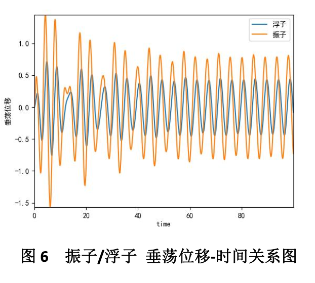

I am a Master’s student in Applied Computational Science and Engineering at **Imperial College London** (2024–2025), with a strong academic foundation in applied mathematics, machine learning, and computer vision.

Previously, I earned a **BSc in Applied Mathematics with Information Computing** from the **University of Birmingham**, graduating with **First-Class Honours**, and a **dual degree in Information and Computing Science** from **Jinan University (JNU)**, where I ranked **7th out of 66** with a **GPA of 3.96/4.25**.

My research interests lie at the intersection of **3D reconstruction**, **implicit surface modeling**, and **AIGC (AI-Generated Content)**. I am particularly focused on enabling machines to better perceive, understand, and represent **3D space**. To deepen my understanding of this field, I have self-studied **Stanford’s CS231A** and explored foundational topics in **SLAM** and **differentiable rendering**.

In 2024, I completed a research thesis titled **"Efficient Mesh Reconstruction from 3D Gaussians with L1 Regularization and Pruning"**, supervised by [Dr. Yizun Lin](https://cybsec.jnu.edu.cn/2023/1205/c39595a783433/page.htm), which explores sparse representations for mesh reconstruction based on **Gaussian splatting techniques**.

Previously, I interned as an **Algorithm Engineer** at the **Virtual Human Division of the Central Research Institute at [CVTE](http://www.cvte.com/)** in Guangzhou, China. I worked on **LLM fine-tuning (via LoRA)**, developed a **PPT-to-script generation API**, and contributed to **TTS data processing pipelines**.

More broadly, I enjoy combining **computational geometry**, **deep learning**, and **vision-based modeling**, and I am passionate about building systems that bridge the gap between **geometry and generation**.

📫 Feel free to reach me at: ethanliu020@outlook.com

---

## Research Experience

### Graduate Thesis  

  

    

Graduate Essay

  

  

**[Efficient Mesh Reconstruction from 3D Gaussians with L1 Regularization and Pruning](https://github.com/Boreas-OuO/SuGaRL1)**  
**Zhishuo Liu**, Yizun Lin  
[PDF](../images/graduate_essay_v1_4.pdf) / [Code](https://github.com/Boreas-OuO/SuGaRL1)  
We implemented L1 regularization and updated the pruning strategy in SuGaR, achieving an ~18% reduction in training time and lower memory usage while maintaining accuracy.
  

---

### Summer Research Project  

  

    

Summer Project

  

  

**DFT Triangle: A Novel Spectrogram Feature for Sharing-Price Prediction by CNN**  
Zhishuo Liu, Zichen Wang, etc.  
[Code](https://github.com/Boreas-OuO/eel-dft)
  

---

## Competitions & Projects

### CUMCM 2022  

  

    

2022 CUMCM

  

  

[2022 Contemporary Undergraduate Mathematical Contest in Modeling (CUMCM)](http://en.mcm.edu.cn/html_en/node/1adbb0bbfa58dfafe2b926539e17daf9.html)  
**Zhishuo Liu**, Zhiqi Ma, Jiayi Wu  
**National Second Prize**  
[Certificate](images/CUMCM.JPG) / [Paper (PDF)](../images/波浪能最大输出功率设计.pdf) / [Problem A](images/A题.pdf)
  

---

### AI Fitness Coach  

  

    

AI Fitness Coach

  

  

[AI Fitness Coach](https://gitee.com/diziliu/ad-adviser/blob/master/readme.md)  
Xiaowen Zheng, **Zhishuo Liu**, Jia Lu, etc.  
**Silver Award (University Level)** – Internet+ Innovation Competition  
[Certificate](images/internet+.jpg) / [Code](https://gitee.com/diziliu/ad-adviser)
  

---

## Honors

- Oct. 2022, **2nd Prize (National Level)** – CUMCM  
- Oct. 2022, **1st Prize (Provincial Level)** – CUMCM  
- Jun. 2022, **Silver Award (University Level)** – Internet+ Innovation Competition  
- Feb. 2022, **Successful Participant** – MCM/ICM  
- Nov. 2021, **3rd Prize** – Asia-Pacific Modeling Contest  
- Oct. 2021, **3rd Prize** – Greater Bay Area Financial Math Modeling

---

## Scholarships

- Oct. 2023, **First-Class Scholarship** (Top 1%)  
-  Feb. 2023, **Rising Academic Star Special Scholarship** (Top 8%)  
-  Oct. 2022 & Oct. 2021, **Second-Class Scholarship** (Top 7%)

---

## Internships

- **Jul – Sept 2023**, Algorithm Intern – [CVTE Virtual Human Division](https://www.cvte.com/)
- See [CV](/cv.pdf) for more details.

---

## About Me

- **Skills**: Python, C/C++, MATLAB, R, PyTorch, TensorFlow, Linux, CUDA  
- **Languages**: Mandarin (Native), English (Proficient)  
- **Extracurricular**: Vice President – JNU Photography Association; Publicity – J-BJI Student Union