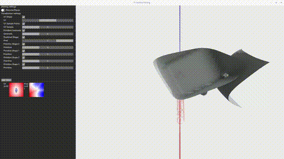
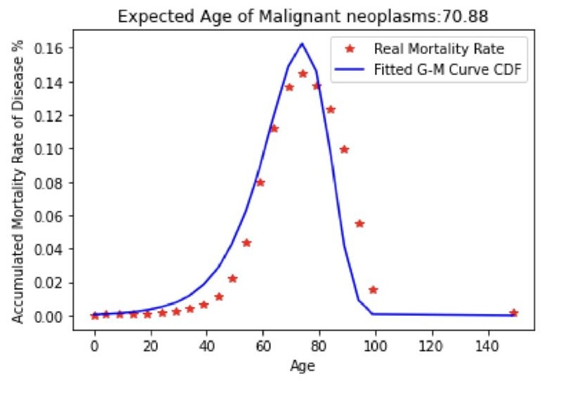
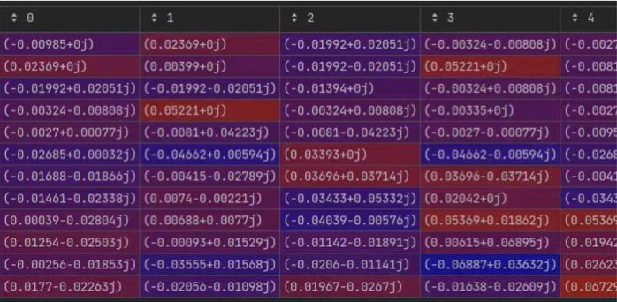
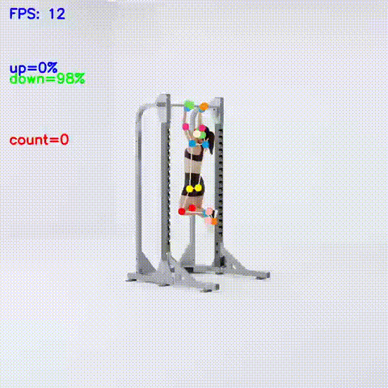
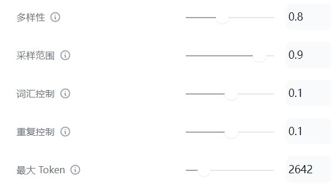

I am a Master's student in **Applied Computational Science and Engineering** at **Imperial College London** (2024–2025), currently conducting an **Individual Research Project (IRP)** in collaboration with **Google**, supervised by **Dr. Hide Matsuki**. Before this, I earned a **BSc in Applied Mathematics with Information Computing** from the **University of Birmingham**, graduating with **First-Class Honours**, and a **dual degree in Information and Computing Science** from **Jinan University (JNU)**, where I ranked **7th out of 66** with a **GPA of 3.96/4.25**.

My research interests lie at the intersection of **3D reconstruction**, **implicit surface modeling**, and **AIGC (AI-Generated Content)**. I am particularly focused on enabling machines to better perceive, understand, and represent **3D space**. To deepen my understanding of this field, I have self-studied **Stanford's CS231A** and explored foundational topics in **SLAM** and **differentiable rendering**.

In 2024, I completed a research thesis titled **"Efficient Mesh Reconstruction from 3D Gaussians with L1 Regularization and Pruning"**, supervised by [Dr. Yizun Lin](https://cybsec.jnu.edu.cn/2023/1205/c39595a783433/page.htm), which explores sparse representations for mesh reconstruction based on **Gaussian splatting techniques**.

More broadly, I enjoy combining **computational geometry**, **deep learning**, and **vision-based modeling**, and I am passionate about building systems that bridge the gap between **geometry and generation**.

📫 Feel free to reach me at: ethanliu020@outlook.com

---

## Research Experience

  

    

Current Research

  

  

**[Learning Compositions of Primitives for 3D Shape Representation](https://github.com/kxhit/sdf-primitive)**  
**Zhishuo Liu**  
*Individual Research Project (IRP) - Industry-Academia Collaboration*  
*Supervised by Dr. Hide Matsuki, Google (Feb 2025 – Present)  
Developed a novel 3D primitive-based shape reconstruction system integrating superquadrics and signed distance field learning. Reproduced methods from papers such as SuperDec and used a transformer-based point cloud clustering approach to guide primitive fitting for improved 3D shape representation and reconstruction accuracy.
  

  

    

Undergraduate Thesis

  

  

**[Efficient Mesh Reconstruction from 3D Gaussians with L1 Regularization and Pruning](https://github.com/Boreas-OuO/SuGaRL1)**  
**Zhishuo Liu**
*Supervised by Dr.Yizun Lin*
[PDF](../docs/graduate_essay_v1_4.pdf) / [Code](https://github.com/Boreas-OuO/SuGaRL1)  
We implemented L1 regularization and updated the pruning strategy in SuGaR, achieving an ~18% reduction in training time and lower memory usage while maintaining accuracy.
  

  

    

Summer Research

  

  

**Aging Cause Analysis: Bayesian Analysis Based on Gompertz-Makeham Model**  
**Zhishuo Liu**  
*University of Birmingham Summer Research* (Jul 2023 - Oct 2023)  
Collected mortality data and patient information for major aging-related diseases in the United States, organized into 5-year interval format, and calculated conditional probabilities and related indicators. Applied Bayesian formulas to assess the impact of curing these diseases on human life expectancy, fitted the Gompertz-Makeham model, and determined constant mortality rate intervals for these diseases through hypothesis testing.
  

  

    

DFT-Tri

  

  

**DFT Triangle: A Novel Spectrogram Feature for Stock Price Prediction by CNN**  
Zhishuo Liu, Zichen Wang, etc.  
**Abstract**: Proposed a novel frequency-domain feature called DFT-triangle for stock price prediction, addressing the limitation of traditional DFT where similar price series exhibit distinct frequency features. The method stacks price series into 2D matrices with transferred frequency features, forming triangular patterns in scale-frequency coordinates. Evaluated on 470 stocks using CNN, DFT-triangle outperformed advanced sequential networks (Attention-LSTM, CNN-LSTM) and traditional econometric models (AR, ARIMA) in stock forecasting accuracy.  
[Code](https://github.com/Boreas-OuO/eel-dft)
  

## Projects

  

    

2022 CUMCM

  

  

[2022 Contemporary Undergraduate Mathematical Contest in Modeling (CUMCM)](http://en.mcm.edu.cn/html_en/node/1adbb0bbfa58dfafe2b926539e17daf9.html)  
**Zhishuo Liu**, Zhiqi Ma, Jiayi Wu  
**National Second Prize**  
**Abstract**: Developed a physics-based dynamic model for wave energy capture devices using Newton's laws and nonlinear differential equations. Implemented optimization algorithms to maximize energy conversion efficiency, achieving 163.8W output power with optimal damping coefficient. The system demonstrates stable periodic power output with 7% efficiency increase per 1% frequency rise.  
[Certificate](images/CUMCM.JPG) / [Paper (PDF)](../images/波浪能最大输出功率设计.pdf) / [Problem A](images/A题.pdf)
  

  

    

AI Fitness Coach

  

  

**[AI Fitness Coach: Real-time Exercise Analysis System](https://gitee.com/diziliu/ad-adviser/blob/master/readme.md)**  
Xiaowen Zheng, **Zhishuo Liu**, Jia Lu, etc.  
**Silver Award** – Internet+ Innovation Competition  
A TensorFlow-based AI fitness coaching system that uses MediaPipe for real-time human pose estimation and machine learning algorithms (logistic regression, etc.) for exercise classification. Features include rep counting, form accuracy detection, and personalized exercise recommendations. The system analyzes body keypoints to provide real-time feedback on exercise performance and technique.  
[Certificate](images/internet+.jpg) / [Code](https://gitee.com/diziliu/ad-adviser)
  

  

    

PPT2Script

  

  

**[PPT2Script: AI-Powered Presentation to Speech Converter](https://github.com/zhishuoliu/ppt2script)**  
**Zhishuo Liu**  
A Flask-based web service that converts PowerPoint presentations into natural speech scripts using AI. The system parses PPT/PPTX files, extracts text content from slides, and generates coherent speech scripts through integration with Dify and ChatGPT (or other LLMs). Features include automatic slide parsing, customizable speech styles, and RESTful API endpoints for file upload and health monitoring.  
[Code](https://github.com/zhishuoliu/ppt2script) / [Demo](https://github.com/zhishuoliu/ppt2script)
  

## Internship

**Algorithm Intern** | **Virtual Human Division, [CVTE](https://global.cvte.com)**  
*July 2023 - September 2023* | Guangzhou, China

**Key Responsibilities & Achievements:**
- **LLM Fine-tuning**: Implemented LoRA (Low-Rank Adaptation) fine-tuning for open-source large language models to achieve stylized text generation for live streaming scenarios
- **Knowledge Base Construction**: Scraped and processed ~1,000 common live streaming room questions to build a knowledge vector database for embedding processing
- **API Development**: Built a Flask-based PPT-to-script conversion API using large language models, deployed via Docker to CVTE's virtual human products
- **Data Annotation**: Reviewed and annotated ~5,000 text-to-speech (TTS) training data samples for model training and quality assurance

**Technologies Used**: Python, Flask, Docker, LoRA, Large Language Models, Web Scraping, TTS, Vector Databases

## Honors

- Oct. 2022, **2nd Prize (National Level)** – CUMCM  
- Oct. 2022, **1st Prize (Provincial Level)** – CUMCM  
- Jun. 2022, **Silver Award (University Level)** – Internet+ Innovation Competition  
- Nov. 2021, **2rd Prize** – Asia-Pacific Modeling Contest  
- Oct. 2021, **3rd Prize** – Greater Bay Area Financial Math Modeling

## Scholarships

- Oct. 2023, **First-Class Scholarship** (Top 1%)  
-  Feb. 2023, **Rising Academic Star Special Scholarship** (Top 8%)  
-  Oct. 2022 & Oct. 2021, **Second-Class Scholarship** (Top 7%)

## About Me

- **Skills**: Python, C/C++, MATLAB, R, PyTorch, TensorFlow, Linux, CUDA  
- **Languages**: English (Proficient), Chinese (Native), Mandarin (Native)  

---

## 🌍 Visitor Map

  

  
  

    
<small>📍 This map shows the locations of recent visitors to my website. Your location will be added when you visit this page.</small>

  

